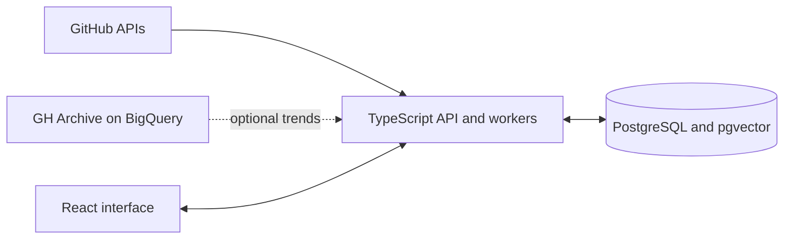

# GitHop

GitHop is a GitHub discovery prototype I built to explore repository activity, developer profiles, and project trends. It combines a React interface with a TypeScript API and PostgreSQL storage. GitHub's APIs provide repository and contributor details; optional GH Archive queries through BigQuery provide activity-based trend windows.

The application was deployed temporarily during development. The historical demo address is not presented as a currently maintained service; this repository is the source and documentation.

## What it includes

- Repository and developer discovery, filters, detail pages, and activity views.
- Background jobs that ingest and enrich GitHub data.
- Optional AI features: local MiniLM embeddings for similarity search and Gemini for query interpretation and summaries.
- A PostgreSQL schema with pgvector for embedding search.



The files in [`Diagrams/`](Diagrams/) and [`Requirements Analysis/`](<Requirements%20Analysis/>) are earlier planning artifacts. The source code is under `frontend/` and `backend/`.

## Run locally

You need Docker with Compose, a GitHub API token, and your own PostgreSQL password.

```bash
git clone https://github.com/IBoutbaoucht/GitHop.git
cd GitHop
cp .env.example .env
```

Open `.env` and provide your own values:

```dotenv
GITHUB_TOKEN=your_github_token
POSTGRES_PASSWORD=choose_a_database_password
ADMIN_TOKEN=choose_an_admin_token
```

Start the application:

```bash
docker compose up --build -d
curl http://localhost:4000/api/health
```

The database starts empty. Run the initial GitHub import, replacing the example header value with the same `ADMIN_TOKEN` stored in `.env`:

```bash
curl -X POST -H "x-admin-token: choose_an_admin_token" http://localhost:4000/api/sync/quick
```

Open `http://localhost:4000` after the import begins. The interface lets users browse and filter repositories, inspect repository activity, explore developer profiles, and use the available search views. Imports run in the background and can take time because they use GitHub API quota.

The default Compose configuration binds the application to your local machine. `GEMINI_API_KEY` enables AI summaries and smart search. GH Archive trend imports require Google Cloud credentials supplied outside this repository; the default Compose setup does not include them. Transformers.js downloads the local embedding model when first used, or at startup if `WARMUP_EMBEDDINGS=true`.

For frontend development outside Docker, run `npm ci` and `npm run dev` in `frontend/`; Vite proxies `/api` to a backend on port 4000. Set `VITE_API_BASE_URL` before building if the frontend is hosted separately from the API.

## Repository layout

| Path | Purpose |
|---|---|
| `frontend/` | React interface and Vite configuration |
| `backend/` | TypeScript API, GitHub integrations, and background workers |
| `database/database.sql` | Fresh PostgreSQL schema |
| `Dockerfile`, `docker-compose.yml` | Local application and database setup |
| `Diagrams/`, `Requirements Analysis/` | Earlier design and requirements material |

## Status and validation

This is a personal project and a research-oriented prototype, not a hosted service with an uptime commitment. The clean public snapshot builds with `npm run build` in both `frontend/` and `backend/`. A full data-ingestion run requires user-supplied GitHub credentials and a local database; the optional cloud features require their own credentials.

No keys or credentials are included. Operator-only POST endpoints require `ADMIN_TOKEN`; never commit `.env`, cloud service-account files, or SSH keys.
