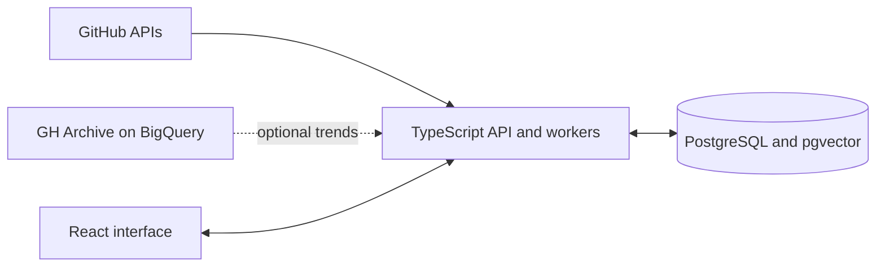

<p align="center">
  
</p>

<p align="center">
  
  
  
  
  
</p>

# GitHop

GitHop is a GitHub discovery platform: it keeps you up to date with what is being built on GitHub — trending repositories, developer profiles, and activity trends — through a social-feed style experience. It combines a React interface with a TypeScript API, background ingestion workers, and PostgreSQL with **pgvector** for semantic similarity over repository embeddings.

## Why it is technically interesting

- **pgvector semantic search** — README embeddings (local MiniLM) make repositories searchable by meaning, not keywords.
- **Always fresh** — background workers continuously ingest commits, contributors, and READMEs; optional GH Archive queries through BigQuery provide activity trend windows.
- **AI layer** — Gemini interprets natural-language queries and summarizes repositories; MiniLM runs locally for embeddings.

## What it includes

- Repository and developer discovery, filters, detail pages, and activity views.
- Background jobs that ingest and enrich GitHub data.
- PostgreSQL schema with pgvector for embedding search.
- One-command local startup with Docker Compose.

## Architecture



Planning artifacts (class and use-case diagrams, requirements analyses) live in [`Diagrams/`](Diagrams/) and [`Requirements Analysis/`](Requirements%20Analysis/). Source code is under `frontend/` and `backend/`.

## Run locally

You need Docker with Compose, a GitHub API token, and your own PostgreSQL password.

```bash
git clone https://github.com/IBoutbaoucht/GitHop.git
cd GitHop
cp .env.example .env
```

Open `.env` and provide your own values:

```dotenv
GITHUB_TOKEN=your_github_token
POSTGRES_PASSWORD=choose_a_database_password
ADMIN_TOKEN=choose_an_admin_token
```

Start the application and seed the database:

```bash
docker compose up --build -d
curl http://localhost:4000/api/health
curl -X POST -H "x-admin-token: choose_an_admin_token" http://localhost:4000/api/sync/quick
```

Open `http://localhost:4000` after the import begins. Imports run in the background and can take time because they use GitHub API quota.

The default Compose configuration binds the application to your local machine. `GEMINI_API_KEY` enables AI summaries and smart search. GH Archive trend imports require Google Cloud credentials supplied outside this repository; the default Compose setup does not include them. Transformers.js downloads the local embedding model when first used, or at startup if `WARMUP_EMBEDDINGS=true`.

For frontend development outside Docker, run `npm ci` and `npm run dev` in `frontend/`; Vite proxies `/api` to a backend on port 4000. Set `VITE_API_BASE_URL` before building if the frontend is hosted separately from the API.

## Repository layout

| Path | Purpose |
|---|---|
| `frontend/` | React interface and Vite configuration |
| `backend/` | TypeScript API, GitHub integrations, and background workers |
| `database/database.sql` | Fresh PostgreSQL schema |
| `Dockerfile`, `docker-compose.yml` | Local application and database setup |
| `Diagrams/`, `Requirements Analysis/` | Earlier design and requirements material |

## Status and validation

This is a personal research-oriented prototype, not a hosted service. The clean public snapshot builds with `npm run build` in both `frontend/` and `backend/`. A full data-ingestion run requires user-supplied GitHub credentials and a local database; the optional cloud features require their own credentials.

No keys or credentials are included. Operator-only POST endpoints require `ADMIN_TOKEN`; never commit `.env`, cloud service-account files, or SSH keys.

---

<p align="center"><sub>MIT License · Built by <a href="https://github.com/IBoutbaoucht">Imad Boutbaoucht</a></sub></p>
